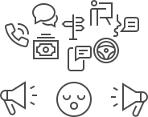

#### Part 1
# 🎢
## Switching Contexts

---

### We switch contexts ALL the time

You're a busy human with lots of inputs, and sometimes you don't feel like yourself.

That's usually a symptom of **context switching**.

---

### From Computer Science
Switching contexts is a concept that comes from computer science, that describes the cost that a computer incurrs when it switches from handling one process to another. 

---

### We're not computers, though...
As humans, we're not adapted to switch contexts. Traditionally, we've focused on one thing at a time. But that's changed with living in the digital age. 

---

# 🖋
### What are times you switch context?
These could be **big life transitions**

*e.g. moving, getting a new job*

or **small switches**

*taking your attention from your work to social media*
